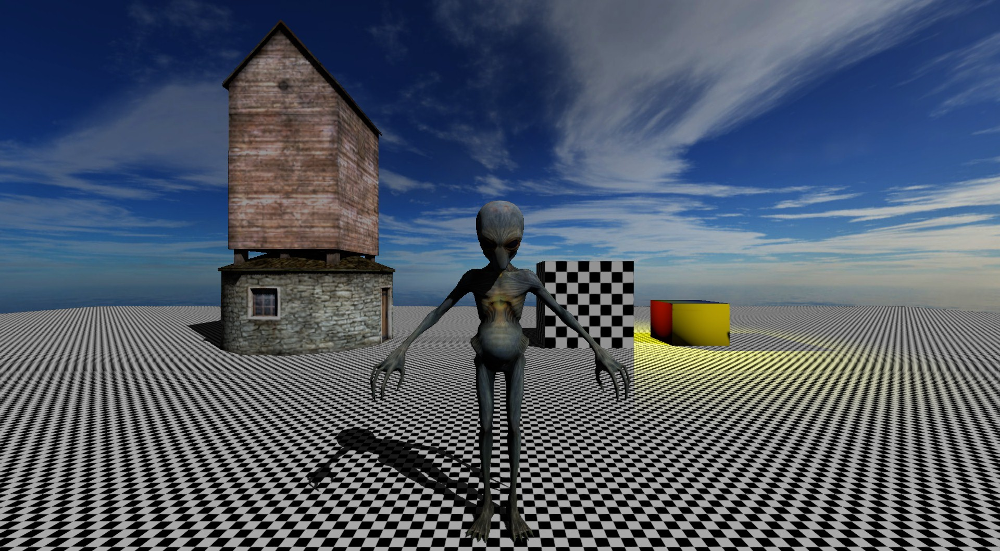

# jonsengine
DirectX11 game engine

# List of features (2015-11-24)

Core:
- File logging
- Memory management
- Basic debugging features

Resources:
- Binary file format for parsing game assets
- Offline asset exporter tool for above mentioned file format
- Various thirdparty libraries to parse a wide range of assets into a unified asset format
- Create basic geometric shapes at runtime

Rendering:
- Directx 11 renderer
- Deferred shading pipeline with phong shading
- Directional/Point/Ambient lights with shadowmapping
- Cascaded shadow mapping (CSM) with Sample distribution shadow maps (SDSM)
- Shadowmap filtering (OptimizedPCF)
- ScreenSpace Ambient Occlusion (Scalable Ambient Obscurance, SAO)
- Antialiasing (FXAA)
- Gamma corrected lighting
- Skyboxes
- Skeletal animations (WIP)

Scene:
- Scenegraph
- Models, materials, animations, cameras, directional/point/ambient lights, skyboxes
- Renderqueue with culling strategies

Window:
- Window management
- Raw keyboard/mouse input handling

